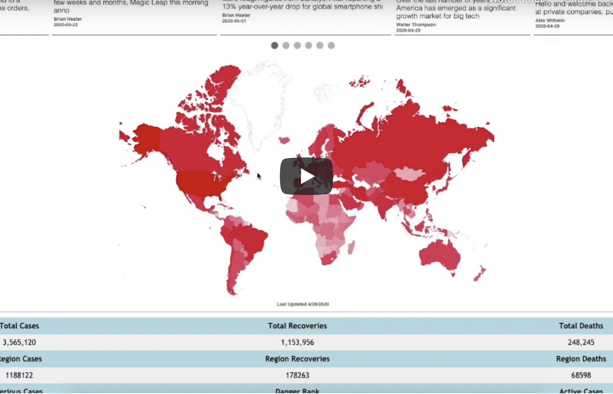

# Safedemic

We are in the midst of a global pandemic that is showing no signs of slowing down. As we all continue to play our part in social distancing, we want to provide the public with a web application that disseminates and collects data regarding current pandemics, their spread, and their impact on our world.

## Demo

Click on the thumbnail below to watch our demonstation video!

CLick on the link below to read our machine learning write up!

https://drive.google.com/file/d/1g9wDfgMELl83YGpag_b3-rVI6cf5FtjH/view

## Features

- Live Statistics: COVID-19 statistics summary based on user selected location.
- Reporting Violations: Report social distancing related violations. The reports will be mapped as they are received.
- Telediagnosis: Report your symptoms to a doctor.
- Artificial Intelligence: COVID-19 spread prediction using machine learning. 
- Live News: Popular news articles relevent to COVID-19 and any progress/breakthroughs made.
- Heatmaps: Maps the current spread of COVID-19 based on patient data from the John Hopkins Whiting School of Engineering. This setting will show the spread in the form of a heatmap.

## What it does
Safedemic allows users to report violations of pandemic-related policies, visualizes the current and predicted spread of pandemics via heat maps, and provides health guidelines, live news, and live statistics to inform users about recent developments regarding the specified pandemics. Safedemic will also ease the process of telediagnosis by allowing users to communicate their medical status to doctors through report forms.

## How we built it
APPLICATION WORKFLOW:

Integration with Firebase Database
Login Screen
Report a Violation Form
Creation of current spread heatmaps
Creation of violation report map markers
Pandemic news panel
Obtain live data for total cases and country-based statistics
Include certified health guidelines
Include option to view the predicted spread in a user-defined location within a user-defined circular region (see machine learning workflow for further details)
Include telediagnosis form which can be sent to doctors (via email) for review
MACHINE LEARNING WORKFLOW:

Compile pandemic data from John Hopkins
Split data into train and test sets
Create a multilayer perceptron to predict the number of cases x days into the future (where x is an input)
Generalize the model to be able to break down the predicted new cases by location as well (in order to visualize predicted spread on map)
Train the model on the training set
Assess the performance of the machine learning model at each individual location and as a whole
Challenges we ran into
For the heatmaps pertaining to current spread, it became largely time-inefficient to obtain live data using web requests. Thus, we decided to store the data into a local .csv file and update the data every 10 hours. For the machine learning model, we had issues linking the model with the prediction spread visualizations on the map. Consequently, we stored the model predictions into a local .csv file and updated the predictions every 10 hours.

## Accomplishments that we're proud of
We were proud that we could provide a more efficient form of telediagnosis (as opposed to time-consuming video conferences) and allow civilians to share/report violations of pandemic-related guidelines and laws. Furthermore, we are satisfied with how we visualized the violation reports, current spread, and predicted spread in the map section of the website.

## What we learned
We learned how to effectively use the Google Maps API and News API. However, what was truly interesting about our endeavors was how we were able to integrate our prior machine learning and web development experience in order to create this web application.

## What's next for Safedemic
We plan to include prediction spread visualization for all countries across the world. Moreover, we plan to attract users initially by using social media outreach on Facebook, Instagram, and Twitter. In addition, we will contact our local law enforcement officers and state representatives in order for them to advertise our product to their larger network. We believe given the current situation that many people will download our application in order to report violations as it is in their personal interest. Ultimately, we plan to attract users nationwide along with targeted advertising in areas with high numbers of infected people and metropolitan areas (NYC, London).

## Built With
- corona-virus-tracker
- css3
- firebase
- google-maps
- html5
- javascript
- news
- python
- tensorflow
- typeform

# Try it out!
